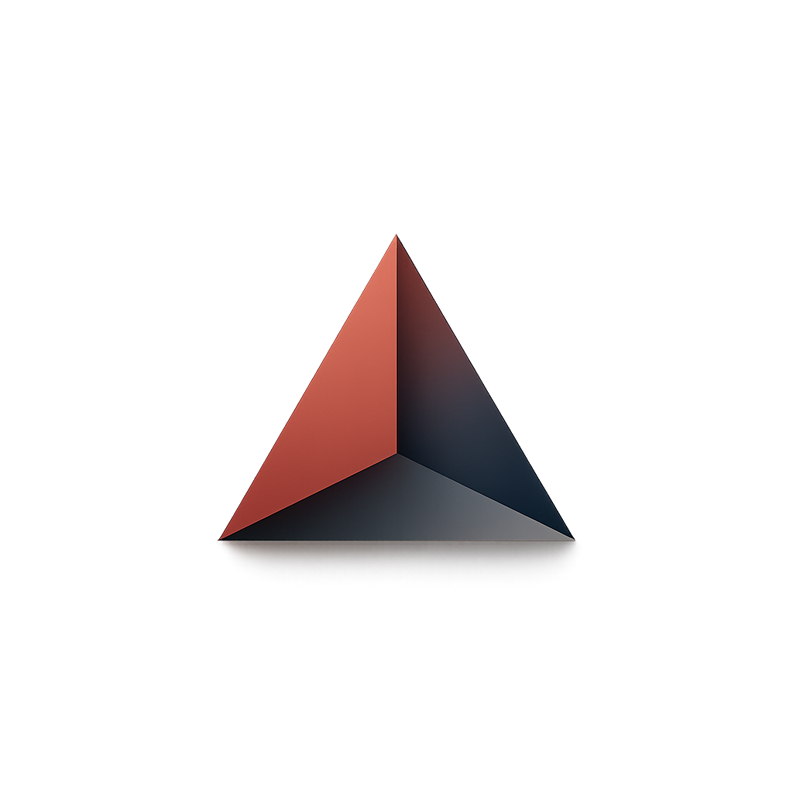

☕ Das Café Shop Project



Bu proje, kahve ürünlerini listeleyebileceğiniz, sepetinize ekleyebileceğiniz ve toplam tutarı görebileceğiniz bir web uygulamasıdır.

🎯 Özellikler

📱 Responsive Tasarım: Tüm cihazlarda uyumlu (mobil, tablet, desktop).

🛒 Sepete Ekleme: İstediğiniz ürünü sepete ekleyebilirsiniz.

💰 Toplam Hesaplama: Sepete eklenen ürünlerin toplam fiyatını anlık görüntüleme.

🎨 Modern Arayüz: Bootstrap 5 ile tasarlanmış şık kullanıcı deneyimi.


🚀 Kullanılan Teknolojiler

HTML5 – Sayfa yapısı

CSS3 & Bootstrap 5 – Responsive tasarım

JavaScript (DOM) – Sepet işlemleri ve toplam tutar hesaplama

## 📁 Kurulum

Projeyi kendi bilgisayarında çalıştırmak için:

1. Bu repoyu klonlayın:
   ```bash
   [git clone [https://github.com/barzandavut/DasCaf-]
   ```

2. Tarayıcıda açmak için:
   ```bash
   index.html dosyasını çift tıklayın veya bir canlı sunucuda çalıştırın.
   ```.

🛠️ Gelecek Geliştirmeler

🔍 Ürün arama ve filtreleme

⭐ Favorilere ekleme özelliği

💳 Online ödeme entegrasyonu

👤  Geliştirici

**Davut Çiftçi**    
- [LinkedIn](https://www.linkedin.com/in/barzandavutciftci/) • [GitHub](https://github.com/barzandavut)
